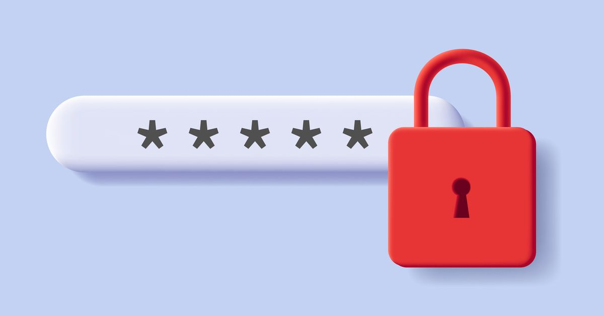

<div align="center">

# 🔐Password Generator Website

This is a Random password generator web app that generate strong and safe passwords.

</div>

<br>

## 🚀Features
- Generate Random passwords
- You can chose type of characters used in your password


## 💼 Tech Stack
- Flask
- Python
- HTML/CSS
- JavaScript


## ▶️ Installation
- Go to where you want to put the project `cd <project_path>`
- Clone the repo to your local machime  `git clone  https://github.com/Mehdi-Talalha/Password-Generator-Website/tree/main.git`
- then install the requirements via `pip install -r requirements.txt`
- run the server using this command in the terminal `flask --app app.py run --debug --port 5001`

```bach
cd <project_path>
git clone  https://github.com/Mehdi-Talalha/Password-Generator-Website/tree/main.git
pip install -r requirements.txt
flask --app app.py run --debug --port 5001
```

## 📃License : **MIT**

## 👨‍💻Authors
- **Mehdi Talalha** && **Ashab Shafqat**
 
<br>

